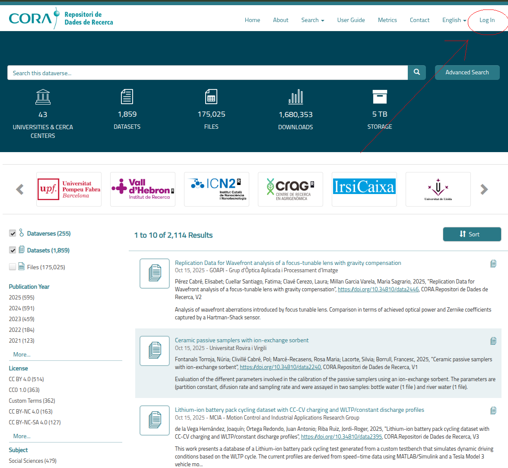
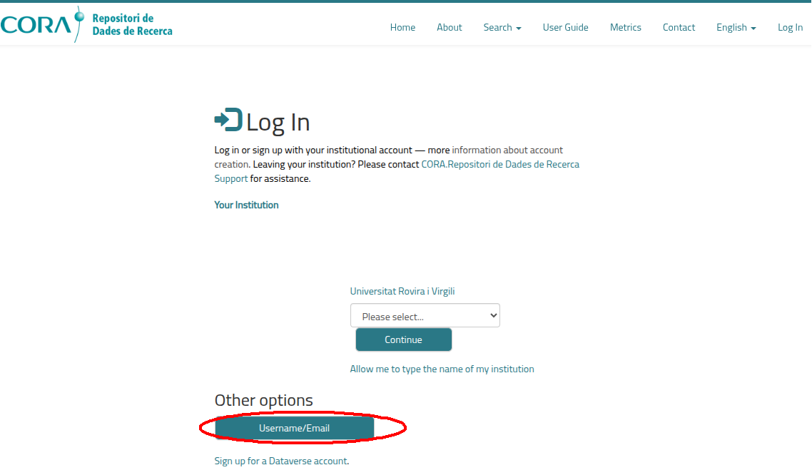
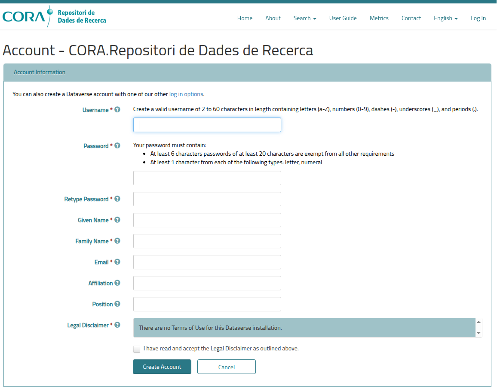
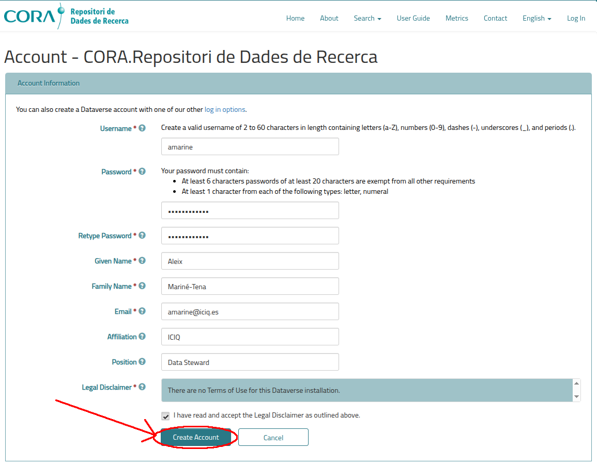

To access the repository you can access the URL [https://dataverse.csuc.cat/](https://dataverse.csuc.cat/).

You will be presented with a page similar to this:

You need to click on the "Log in" button on the right upper corner of the screen, which is is circled in red. 

After clicking that button you will be presented with this screen:

You need to click on the "Sign up for a Dataverse account." text in the center of the screen circled in red. 

After clicking that text you will be presented with this form:

You need to complete each field with the required value:

* Username: A name for your user. It can be anything, even your name and surname.
* Password: Do not use passwords that you use in other sites or with words that are in the dictionary please. Go to 
[LastPass Password Generator](https://www.lastpass.com/es/features/password-generator), generate a password and save it
into your password manager, such as [Google Passwords](https://passwords.google.com/).
* Retype Password: Repeat your chosen password. 
* Given Name: Your first name.
* Family Name: Your surname. 
* Email: Your ICIQ email.
* Affiliation: You may write "ICIQ" as your affiliation. 
* Position: The name of your job position at ICIQ. 

Finally, you need to check the checkbox with the text "I have read and accept the Legal Disclaimer as outlined above.".

