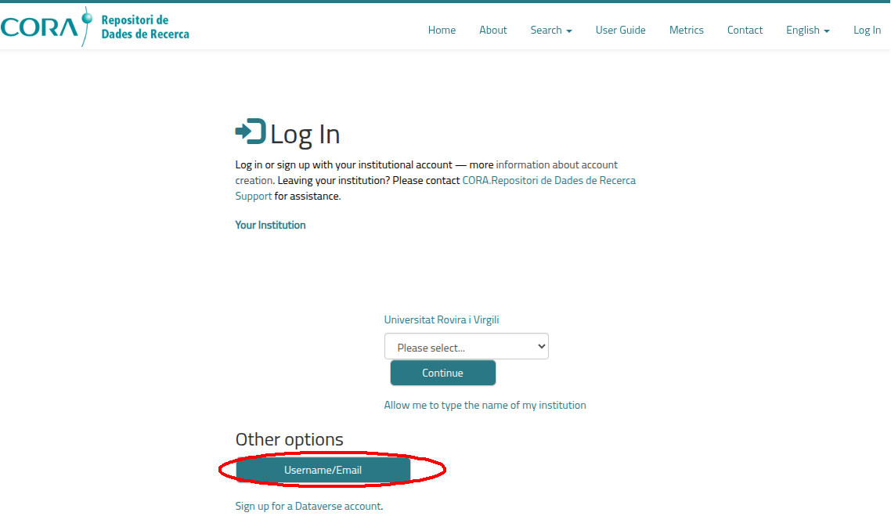

## Login
After you have done [the article to create your account](https://iciq-dmp.github.io/CORA.RDR/User-Guide/Create-user), 
you can now login into CORA.RDR.

To do so, you must access with a browser the URL [https://dataverse.csuc.cat/loginpage.xhtml](https://dataverse.csuc.cat/loginpage.xhtml).

In this URL, you will be presented with a page similar to the following. You need to click the button Username/Email, 
circled in red:

After you click in the button, you will be presented with this form, where you need to introduce the Email in (1) and 
the Password 
that you used [in your sign-up of CORA.RDR](https://iciq-dmp.github.io/CORA.RDR/User-Guide/Create-user) (2) and then 
click 
in the "Log in" button (3). 

If everything is correct, you will be logged in and be presented with the main page of CORA.RDR:

