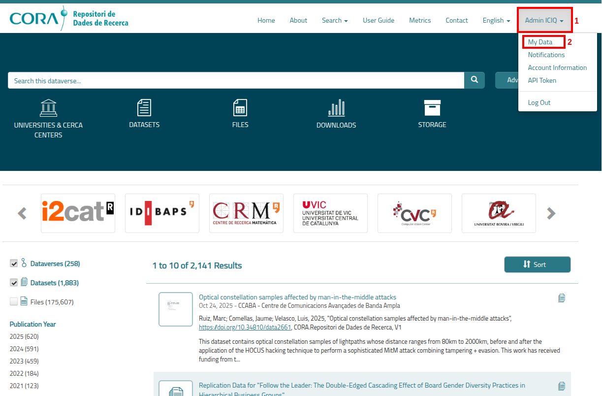
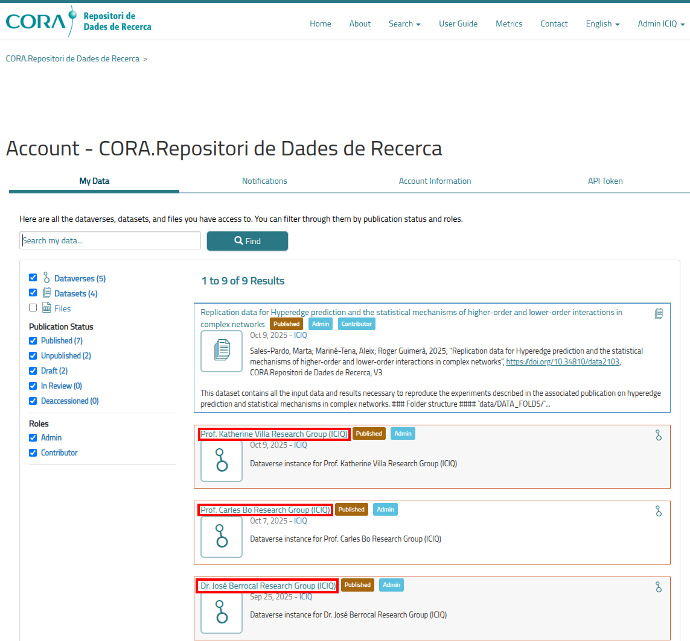
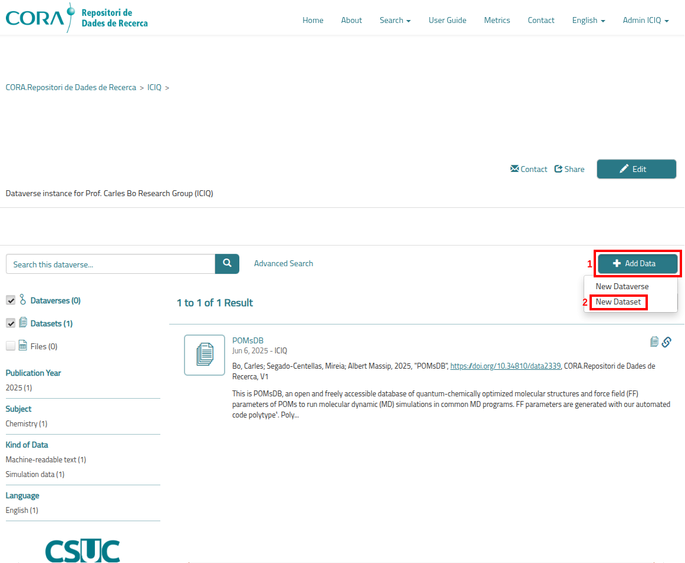
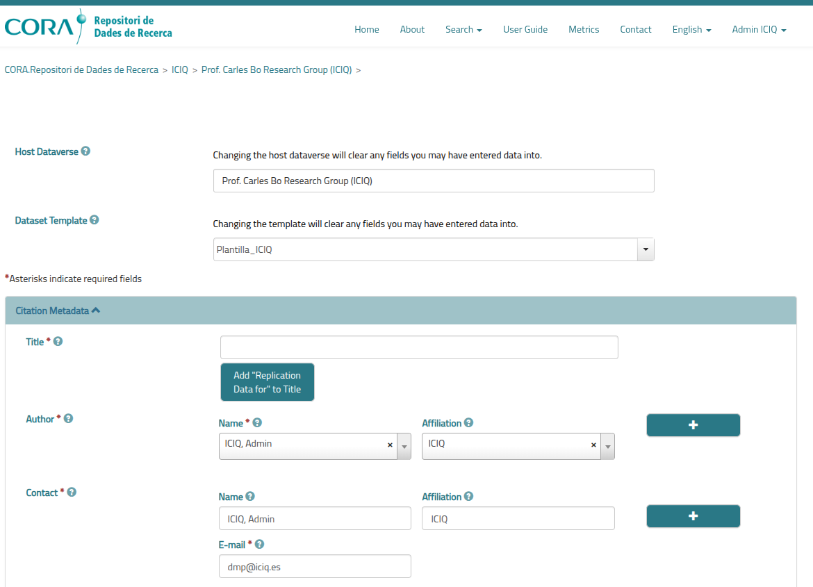
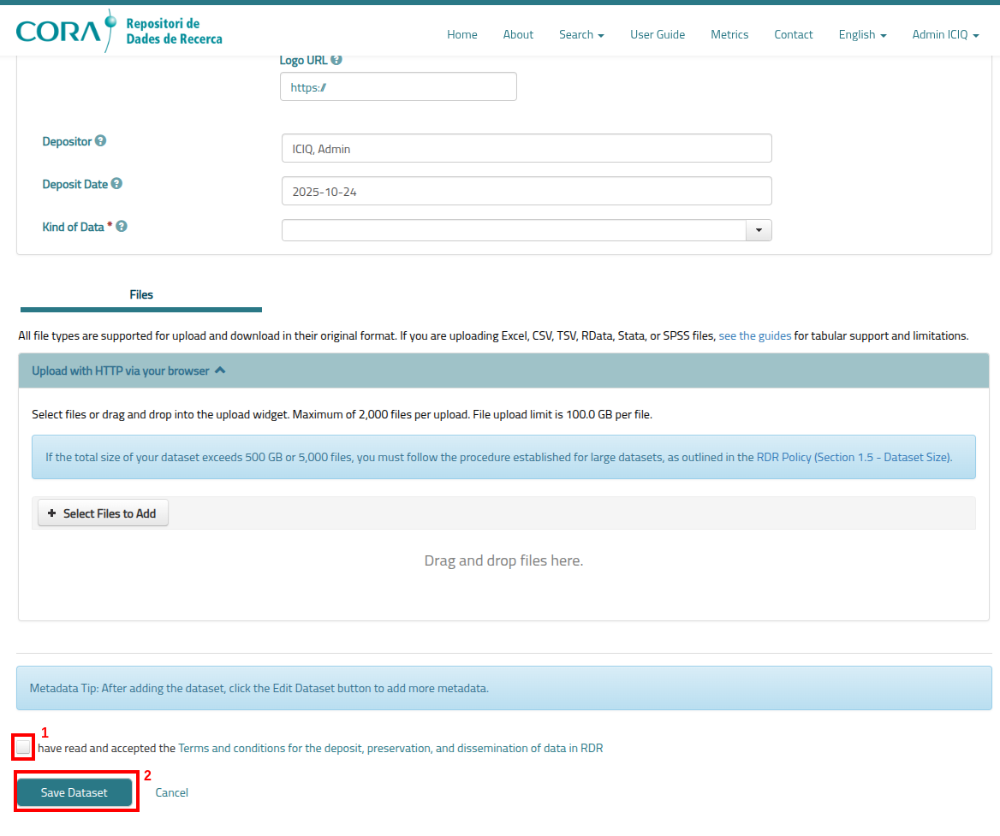
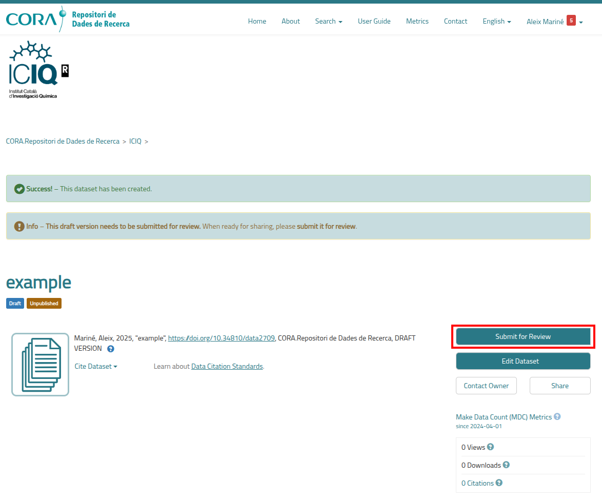
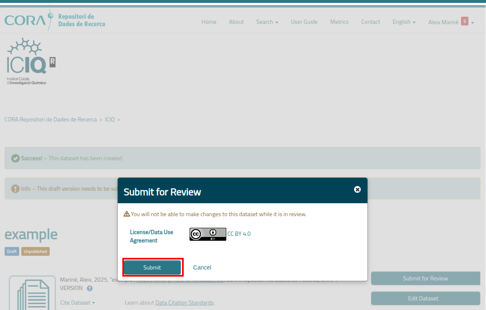
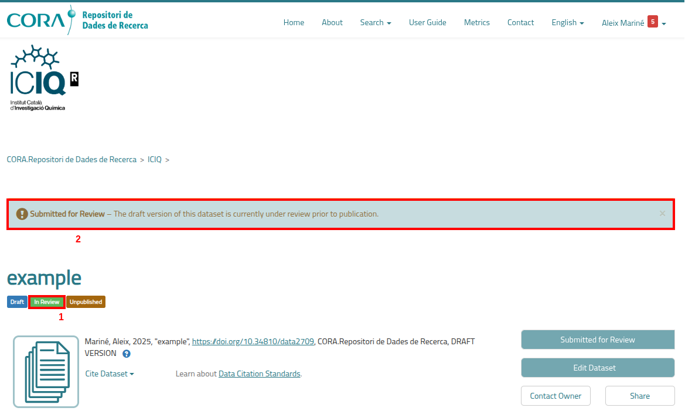

## Upload a new dataset

After you have done 
[the guide to create a new user in CORA.RDR](https://iciq-dmp.github.io/CORA.RDR/User-Guide/Create-User), followed by 
[the guide to get your user added into your own research group Dataverse](https://iciq-dmp.github.io/CORA.RDR/User-Guide/Add-User-ICIQ-Dataverse),
you are ready to upload your own dataset. 

First of all, you must be logged in into CORA.RDR. 
[You can follow this article to do it](https://iciq-dmp.github.io/CORA.RDR/User-Guide/Add-User-ICIQ-Dataverse). 

After being logged in, you must click in the dropdown menu that you can find in the top right corner of the page with 
your username (1), in my case "Admin ICIQ". After that, you must click on "My data" (2) to access the available data in 
your Dataverse. 

You will be presented with a page similar to this:

You will see all the available sub-Dataverses and datasets in the ICIQ Dataverse. We will be ignoring the datasets and 
only focusing on the sub-Dataverses (marked in red): "Prof. Katherine Villa Research Group (ICIQ)",
"Prof. Carles Bo Research Group (ICIQ)", "Dr. José Berrocal Research Group (ICIQ)"...

We will search and click the sub-Dataverse corresponding to your research group. In my case I will choose arbitrarily 
as example the 
sub-Dataverse
"Prof. Carles Bo Research Group (ICIQ)".

After clicking in your corresponding sub-Dataverse, you will be presented with a page similar to the following, where 
you need to click "Add Data" (1) to show a dropdown menu with the item "New Dataset" (2).

After that, you will be presented with our final page: The Dataset addition form, which looks similar to this: 

To add a dataset you need to introduce two types of information:
* **The metadata fields**: The data that describes your dataset, its author, affiliation, related web page... You need 
  to fill in *as many as possible* metadata fields with the information of the dataset. The explanation for each
  field can be found in the article [Dataset Fields](https://iciq-dmp.github.io/CORA.RDR/User-Guide/dataset-fields).
* **The files**: The files that you want to add to this dataset. There are no limitations regarding format, but there 
  are some recommendations that you should follow. There is also a soft limit of 500 GB in a single dataset, but it can
  be bypassed by requesting it to the admins of CORA.RDR. The article 
  [Dataset Files](https://iciq-dmp.github.io/CORA.RDR/User-Guide/dataset-fields) 

After you have introduced all the possible fields and your files in the dataset, you need to go to the bottom of the 
page, where you will see a part of the page similar to the following, where you need to check the checkbox "I have read 
and accepted the Therms and conditions for the deposit, preservation, and dissemination of data in RDR" (1) and then 
click in the button "Save Dataset" (2): 

After clicking the "Save Dataset" button you will be presented with a page similar to the following, where you need to 
click into the button "Submit for Review" to end the process so that the ICIQ CORA.RDR admin validates your dataset and
approves its publication. 

Finally, a last pop-up windows will appear to make you confirm the license of the dataset by clicking the "Submit" 
button. 

To confirm that everything went correctly, you can notice the tag "In Review" (1) that should have appeared under the 
dataset title and also the warning message "Submitted for Review – The draft version of this dataset is currently under 
review prior to publication" (2).

Thank you for your contribution to Open Science! 

